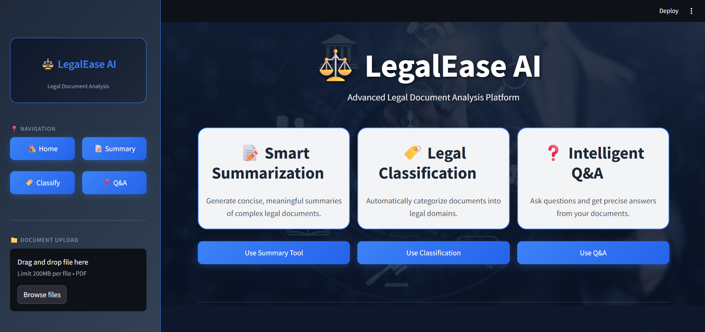
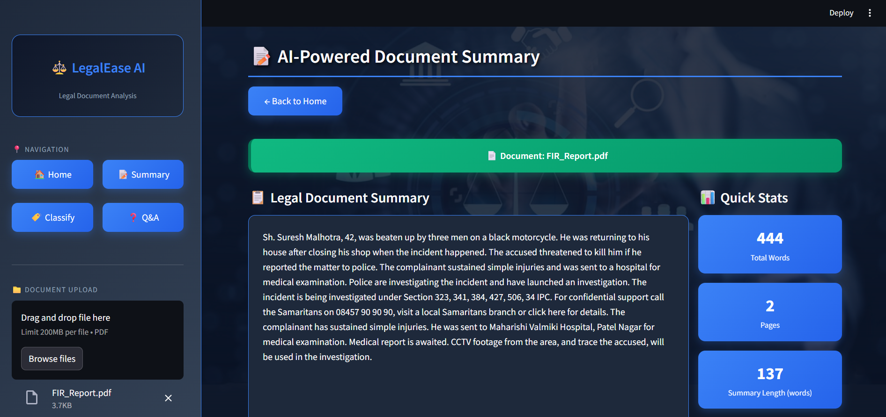
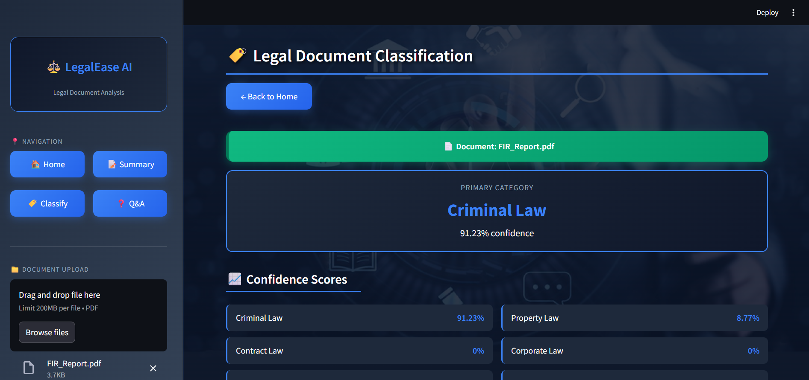
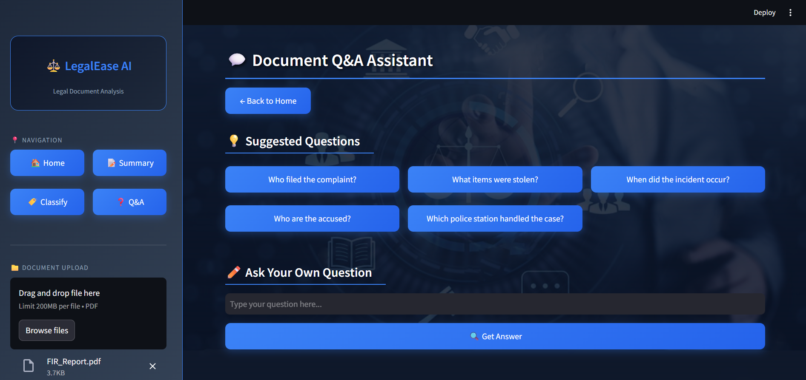
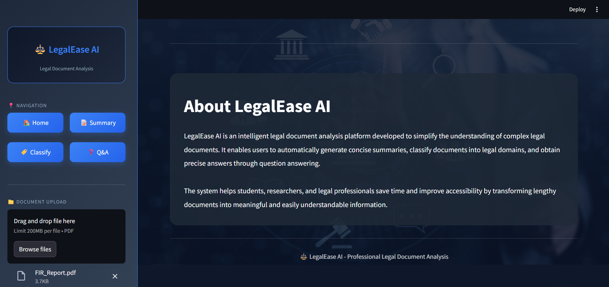

# LegalEase AI

An intelligent legal document analysis platform that automatically summarizes, classifies, and answers questions from legal PDF documents using state-of-the-art NLP models.

---

## About the Project

Legal documents are complex, lengthy, and difficult to understand for most people. LegalEase AI simplifies this by providing three core capabilities — automatic summarization, legal domain classification, and document-based question answering — all through an interactive Streamlit web app.

The system is designed to help students, researchers, and legal professionals save time and improve accessibility by transforming lengthy legal documents into meaningful, easily understandable information.

---

## Dataset Note

LegalEase AI does not rely on a fixed training dataset — it processes any legal PDF document uploaded by the user at runtime. Three sample PDF files are included in the `sample_data/` folder for testing and demonstration purposes. These files were synthetically generated based on real-world legal document structures (FIR format, civil court records, criminal case records) due to unavailability of public legal document datasets caused by medical and legal data privacy restrictions.

---

## Workflow

1. Upload a legal PDF from the sidebar
2. App automatically extracts text using PyPDF2
3. BART model generates an abstractive summary with chunking for long documents
4. Keyword classifier detects the legal category with confidence percentage
5. Navigate to Q&A — suggested questions appear based on detected category
6. Ask custom questions — RoBERTa extracts precise answers from the document

---

## Tech Stack

- Python 3.11
- Streamlit
- HuggingFace Transformers
- PyTorch
- PyPDF2

---

## Models Used

| Task | Model |
|------|-------|
| Summarization | `facebook/bart-large-cnn` (Abstractive — BART) |
| Question Answering | `deepset/roberta-base-squad2` (Extractive — RoBERTa) |
| Classification | Custom Weighted Keyword Scoring (Rule-based NLP) |

---

## Supported Legal Categories

| Category | Examples |
|----------|---------|
| Criminal Law | FIR, Assault, Theft, Murder cases |
| Contract Law | Agreements, NDA, Service contracts |
| Corporate Law | Company records, Mergers, Shareholder docs |
| Property Law | Sale deed, Lease, Rent agreements |
| Intellectual Property Law | Patents, Trademarks, Copyright |
| Employment Law | Offer letters, Termination, HR policies |

---

## Results

| Document | Classification | Confidence |
|----------|---------------|------------|
| FIR_Report.pdf | Criminal Law | 91.23% |
| civil_case_sample.pdf | Contract Law | Correctly Classified |
| Criminal_Law_Dataset.pdf | Criminal Law | Correctly Classified |

---

## Streamlit App Features

- Sidebar navigation with PDF upload
- AI-powered abstractive summary with document stats (words, pages, summary length)
- Legal category classification with confidence scores for all categories
- Context-aware suggested questions based on detected legal category
- Custom question input with extractive answer from document
- Clean dark theme UI with blue accent design

---

## Screenshots

### Home Page


### AI-Powered Summary


### Legal Document Classification


### Document Q&A Assistant


### About Section


---

## How to Run Locally

> **Note:** This project uses large NLP models (BART ~1.6GB + RoBERTa ~500MB). Due to these memory requirements, it is not deployed on Streamlit Cloud. Please follow the steps below to run it on your local machine.

---

### Prerequisites

Before running the app, make sure you have the following installed:

- **Python 3.11** — [Download here](https://www.python.org/downloads/release/python-3110/)
- **Git** — [Download here](https://git-scm.com/downloads)
- **~3GB free disk space** — for NLP model downloads (one-time only)
- **~4GB RAM minimum** recommended

---

### Step 1 — Clone the Repository

Open terminal or command prompt and run:

```bash
git clone https://github.com/prince-joshi/LegalEase-AI.git
cd LegalEase-AI
```

---

### Step 2 — Create a Virtual Environment

```bash
python -m venv venv
```

Activate it:

**Windows:**
```bash
venv\Scripts\activate
```

**Mac / Linux:**
```bash
source venv/bin/activate
```

---

### Step 3 — Install Dependencies

```bash
pip install -r requirements.txt
```

> This will install Streamlit, HuggingFace Transformers, PyTorch, and all other required libraries.

---

### Step 4 — Run the App

```bash
streamlit run app.py
```

> The app will open automatically in your browser at `http://localhost:8501`

---

### Step 5 — Test the App

- Go to the sidebar and upload any PDF from the `sample_data/` folder
- Three sample files are provided — `FIR_Report.pdf`, `civil_case_sample.pdf`, `Criminal_Law_Dataset.pdf`
- App will automatically generate summary and classify the document
- Navigate to Q&A page to ask questions about the document

> **First Run Note:** On first run, the app will automatically download BART and RoBERTa models (~2GB total). This is a one-time download — models are cached locally after that. Please wait 2-5 minutes depending on your internet speed.

---

## Sample Data

Three sample PDF files are included in `sample_data/` folder for testing:

| File | Type |
|------|------|
| `FIR_Report.pdf` | Criminal Law |
| `civil_case_sample.pdf` | Contract / Civil Law |
| `Criminal_Law_Dataset.pdf` | Criminal Law |

---

## Files

| File | Description |
|------|-------------|
| `app.py` | Main Streamlit app — UI, navigation, session state |
| `modules/document_reader.py` | PDF text extraction using PyPDF2 |
| `modules/summarizer.py` | Abstractive summarization — BART with chunking |
| `modules/classifier.py` | Legal category classification — weighted keyword scoring |
| `modules/qa_engine.py` | Question answering — RoBERTa extractive QA |
| `requirements.txt` | Python dependencies |
| `sample_data/` | Sample legal PDFs for testing |
| `assets/screenshots/` | App UI screenshots |
